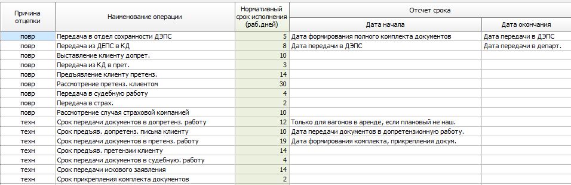
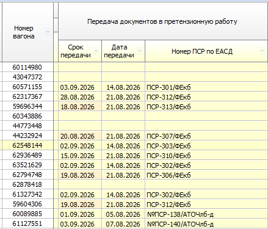

Нужна таблица НСИ для контроля сроков завершения каждого этапа при ведении претензионной работы по гарантийным ремонтам и повреждениям вагонов:

На основании этих настроек мы будем определять, была ли допущена просрочка в обработке и на каком этапе:

заполнение врукную будет этого nsi
